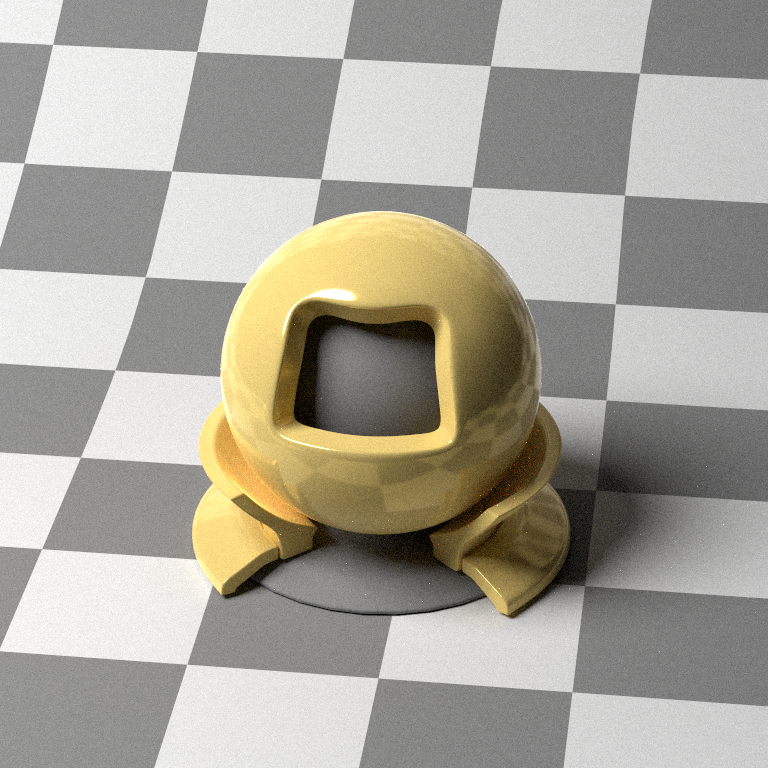

# pathtracer

Toy project to learn rust

Current progress (1920x1080, 256 spp, 259 sec)

TODO: 
- Support loading/writing materials, objects, etc from config files

TODO LATER: 
- gui
- make faster
- ADD MESHES
- better pathtracing methods

TODO LATER LATER:
- tests haha

[_Ray Tracing: The Next Week_](https://raytracing.github.io/books/RayTracingTheNextWeek.html)
